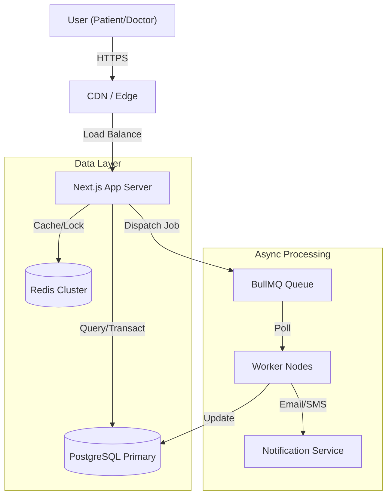
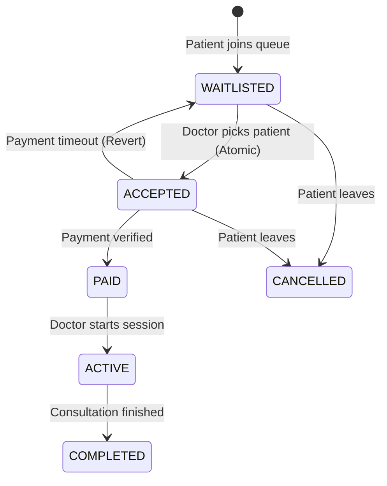

# Medical Consultation Platform
### Secure, Real-Time, HIPAA-Compatible Telemedicine Architecture

> **Mission:** To provide a robust, production-grade infrastructure for secure doctor-patient consultations, ensuring high data integrity, race-condition-free scheduling, and verifiable audit trails.

---

## 🏗 System Architecture

This project is not just a web application; it is a **distributed system** designed to handle concurrency, data consistency, and regulatory compliance.

### Core Components

| Component | Technology | Role & Responsibility |
|-----------|------------|-----------------------|
| **Frontend** | Next.js 15 (App Router) | Server-side rendered UI, Server Actions for secure mutations. |
| **Database** | PostgreSQL + Prisma ORM | Relational data integrity, ACID transactions for critical paths. |
| **Queue Engine** | BullMQ + Redis | Background job processing (notifications, timeout handling). |
| **Cache/Locking** | Redis (IORedis) | Distributed locking, rate limiting, and ephemeral state (presence). |
| **Auth** | Custom Session (HTTP-only) | Secure, stateless-ish session management protected from XSS. |

### System Context Diagram



---

## ⏱ Real-Time Queue & Scheduling Engine

The heart of the application is a **First-In-First-Out (FIFO) Consultation Queue** that manages access to doctors. This system solves complex distributed systems problems:

1.  **Race Conditions:** Multiple doctors trying to accept the same patient.
2.  **Abandoned Sessions:** Patients leaving the queue or payments timing out.
3.  **Concurrency:** High-load queue pushes and pops.

### State Machine Workflow

The consultation lifecycle is governed by a strict state machine to prevent invalid transitions.



### Critical Implementation Details

#### 1. Atomic Doctor Acceptance
To prevent "double-booking", we use atomic database updates with raw SQL to bypass Prisma's application-level restrictions when necessary, ensuring database-level concurrency control.

```typescript
// Atomic update with status guard
const result = await prisma.$queryRaw`
  UPDATE "ConsultationSession"
  SET status = 'ACCEPTED', 
      "acceptedAt" = NOW(), 
      "acceptedBy" = ${doctorId}
  WHERE id = ${consultationId} AND status = 'WAITLISTED'
  RETURNING *
`;
```

#### 2. Distributed Locking & Rate Limiting
We employ **Redis** to enforce rate limits on write-heavy endpoints, protecting the database from surge traffic.
- **Pattern:** `check-before-action` with compensation logic.
- **Strategy:** Sliding window rate limiting for API routes.

#### 3. Resilience & Crash Safety (The "Outbox" Pattern)
(Planned/Partial Implementation) To ensure no background jobs are lost if the server crashes after a DB commit but before a Queue dispatch, the architecture supports a **Transactional Outbox Pattern**:
1.  **Transaction:** Write data to `Consultation` table AND write event to `Outbox` table.
2.  **Worker:** Asynchronously polls `Outbox` and pushes to Redis/BullMQ.
3.  **Result:** Zero data loss, eventual consistency.

---

## 🔒 Security & HIPAA Alignment

This architecture is built with "Security by Design" principles, specifically targeting HIPAA requirements for data privacy and auditability.

### 1. Role-Based Access Control (RBAC)
Strict typed guards (`requireRole('DOCTOR')`, `requireVerifiedDoctor()`) ensuring vertical privilege escalation is impossible. Use of `HTTP-only` cookies prevents token theft via XSS.

### 2. Immutable Audit Logs
Every sensitive action (View Record, Prescribe, Join Queue) creates an append-only log entry.
- **Privacy:** Metadata is sanitized (No PHI in logs).
- **Tracability:** IP address, User Cloud Agent, and Timestamp recorded.

### 3. Data Integrity Verification
Medical reports (PDFs/Images) uploaded to the system are hashed (SHA-256). This hash is stored in the database. When retrieving a file, the hash is re-calculated to prove the file has not been tampered with or corrupted (Data Integrity).

---

## 🛠 Database Schema Design

Three core design patterns drive the storage layer:

1.  **Immutability:** `MedicalReport` and `Prescription` tables are effectively append-only. Versions are linked, preserving history.
2.  **Normalization:** Strict 3NF to prevent data redundancy.
3.  **Indexing:** Heavy use of compound indexes `@@index([status, createdAt])` to ensure `O(log n)` queue polling performance even with millions of records.

---

## 🚀 Deployment & Setup

### Prerequisites
- Node.js 18+
- PostgreSQL
- Redis

### Quick Start
```bash
# 1. Install dependencies
npm install

# 2. Setup Environment
cp .env.example .env
# Edit .env with your DB credentials

# 3. Database Migration
npx prisma migrate dev --name init

# 4. Seed Data (Admin, Doctor, Patient)
npm run seed

# 5. Start Dev Server
npm run dev
# Start Workers (in separate terminal)
npm run worker
```

### Running Tests
We enforce strict type safety. Run the comprehensive type check before pushing:
```bash
npx tsc --noEmit
```

---

## 📦 Project Structure

The codebase follows a **Domain-Driven Design (DDD)** inspired structure:

```
├── app/
│   ├── api/            # API Layer (Controllers)
│   ├── queue/          # Queue Management Logic
│   └── (routes)/       # Next.js Pages
├── lib/
│   ├── queue.ts        # BullMQ Configuration
│   ├── audit.ts        # Audit Logging System
│   └── rbac.ts         # Security Guards
├── prisma/
│   ├── schema.prisma   # Source of Truth for Data Models
│   └── seed.ts         # Test Data Generation
└── worker/             # Background Job Processors
```

---

**Disclaimer:** This software is a reference implementation for high-scale telemedicine architectures. For production deployment, ensure rigorous penetration testing and HIPAA compliance auditing.
